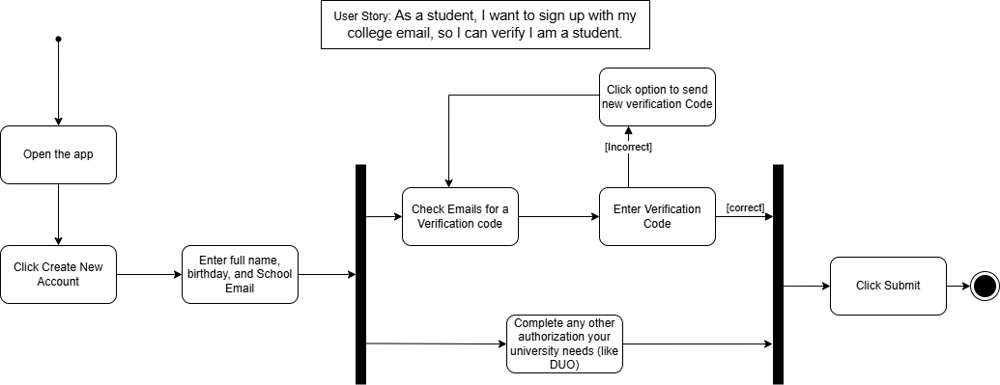
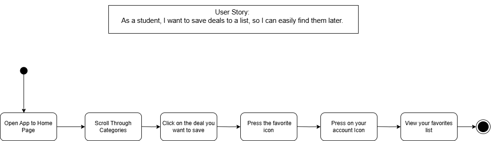

# Specification Phase Exercise

A little exercise to get started with the specification phase of the software development lifecycle. See the [instructions](instructions.md) for more detail.

## Team members

- [Tadelin De Leon](https://github.com/TadelinD)
- [Brandon Morales](https://github.com/BAMOEQ)
- [Suhan Suresh](https://github.com/Suhansrh)
- [Isaac Vivar](https://github.com/isaacv3)

## Stakeholders

- Interviewed Carissa Contreras
- When using coupons the user wants a quick and easy way to find coupons. Deals should be grouped into categories like fast food, retail, and tickets so they can search through what they are interested in. 
- She also notes how it would be helpful if there was one place where she can save deals 
for when she wants to use them later. 
- She showed frustration when student deals require the verification of an ID since sometimes the verification does not go through due to the variety of ID’s. Instead, they would rather use their school emails as that is quick and easy to verify. 
- Users also find frustration when they encounter deals that have ended or forgot to use a deal before the expiration date. They insist expiration dates should be clear and an alert that one of their interested deals is going to expire soon would be helpful. However, most email notifications based on deals have frequent notifications and messages that make them annoying, so notifications should be kept to a minimum.
- She showed interest in a rewards system for the app as that would incentivize her to use it more often. 
- She also said that recommended deals would be a good addition so good deals that she hadn’t previously known about would be brought to her attention.

## Product Vision Statement

An app based around student deals that users can save and use whenever they need.

## User Requirements

- As a student, I want to browse through different categories, so I can look for what I am interested in. 
- As a student, I want to save deals to a list, so I can easily find them later. 
- As a student, I want to sign up with my college email, so I can verify I am a student. 
- As a student, I want to see discounts that can be used by all students or my specific college, so I know that I can use them.
- As a student, I want to see when the deal expires, so I know when I can’t use it anymore.
- As a student, I want notifications for when a discount from my list is expiring, so I can use it before it expires. 
- As a student, I want to search by stores, so I can look through deals of my favorite stores. 
- As a student, I want to earn points for using the app, so I can earn more rewards. 
- As a student, I want to read direct instructions for streaming service student discounts, so that I can follow them without confusion.
- As a student, I want recommended deals on the home screen, so I can see potential deals I would be interested in.

## Activity Diagrams

## Clickable Prototype

[View Prototype](https://www.figma.com/proto/MPgdLar9ZpoO0Sfj5VFseh/Merge-Conflicts?node-id=14-3&p=f&t=cAqEPEQATLVcwHci-1&scaling=scale-down&content-scaling=fixed&page-id=0%3A1&starting-point-node-id=14%3A3)